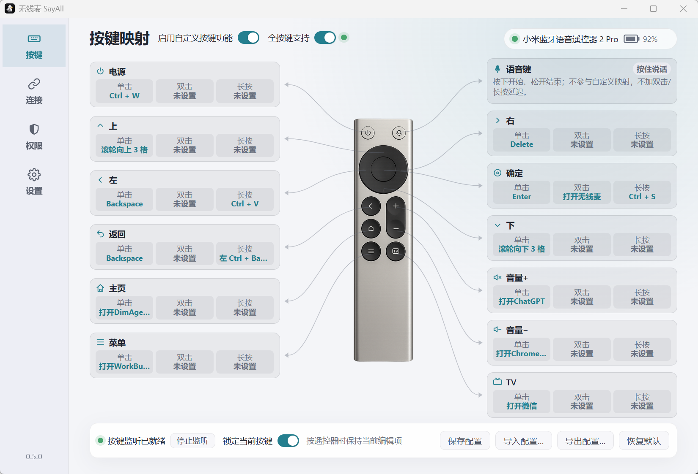
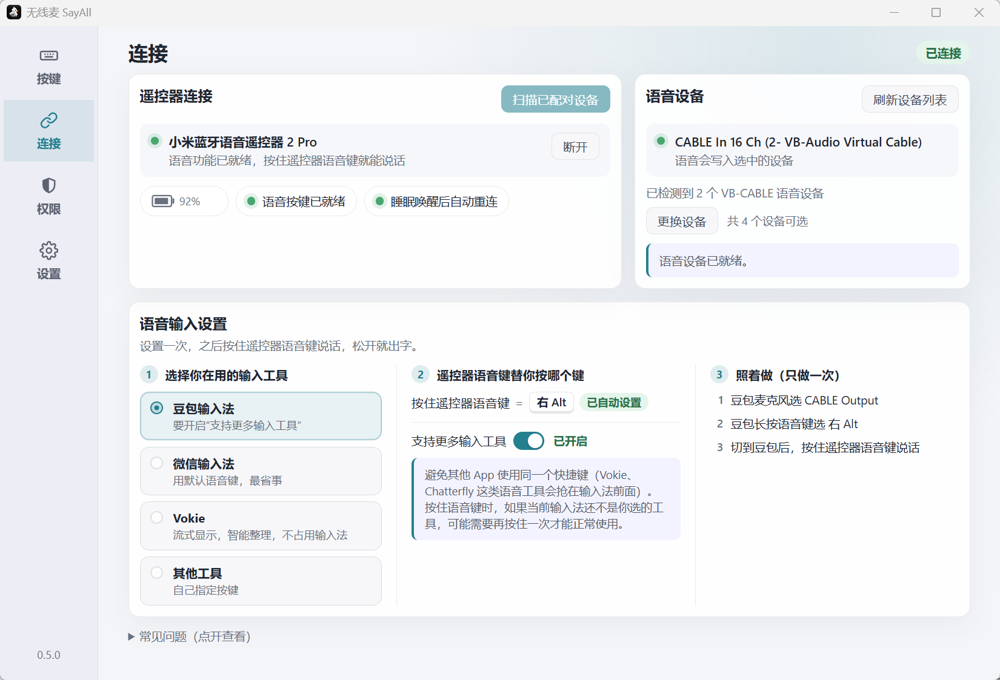

# 无线麦 SayAll for Windows

  

小米蓝牙遥控器的可视化按键映射

<table>
  <tr>
    <td align="center">
       
      <strong>Windows 用户交流群</strong> 
      微信扫码加入交流群
    </td>
    <td align="center">
       
      <strong>小红书</strong> 
      扫码关注无线麦
    </td>
  </tr>
</table>

## 视频介绍

《可能是我最近用过最不像工具的工具》展示了无线麦如何把蓝牙语音遥控器变成随手表达、控制电脑和与 AI 协作的新入口。视频中的产品界面以当时展示版本为准。

  

<a href="https://www.bilibili.com/video/BV13Pep6BEXe">点击封面或前往 Bilibili 观看原视频</a>

视频作者：[可乐不甜的跑焦日记](https://space.bilibili.com/327214328)

无线麦 SayAll Windows 版让小米蓝牙遥控器在电脑上帮你说话、顺手干活：按住遥控器语音键说话，文字直接出现在正在使用的输入框；遥控器按键可以设置成常用快捷键，或用来打开某个应用。

支持两种型号，均已在 Windows 上完成真机适配：

- 小米蓝牙遥控器 2（RC001）
- 小米蓝牙遥控器 2 Pro（RC003）

## 主要功能

- **按住说话**：按住遥控器语音键说话，松开后文字出现在输入框。支持豆包输入法、微信输入法、Vokie 和其他语音工具，选好工具后应用会自动配好快捷键和准备步骤。
- **按键映射**：每个按键的单击、双击、长按都能分别设置，可以映射为常用快捷键，或用来打开应用。
- **全按键支持**：开启后，返回、音量+、音量− 也能自定义。每次开启 Windows 都会弹出授权询问，请选择“是”。
- **省心的连接**：自动记住你的遥控器和语音设备；断连、睡眠唤醒后自动恢复。
- **个性化设置**：外观跟随系统或手动选择深浅色、登录时自动启动、应用图标切换、检查更新。
- **配置备份**：按键映射可导出为文件，换电脑时导入即可用。
- **问题反馈**：权限页可一键生成诊断摘要（不含设备地址与语音内容），随问题一起提交。

两种型号的按键映射都已在 Windows 真机上验收通过。当前为预览版本：安装包还没有 Windows 代码签名，首次运行时可能出现 SmartScreen 提示，按安装指南说明继续即可。

## 用户安装与配置

首次安装、遥控器配对、语音软件设置、按键映射、更新和排障步骤，见 [安装与配置指南](docs/installation-and-configuration.md)。各版本的更新内容见 [GitHub Releases](https://github.com/GetSayAll/remote-mic-app-windows/releases)。

  

连接遥控器，选择语音设备与输入工具

## 参与开发

开发环境、构建与本地检查流程见 [DEVELOPMENT.md](DEVELOPMENT.md)。

## 开源协议

程序代码使用 GPL-3.0-only。App Logo 和 App Icon 是保留版权的专有品牌资产，不属于 GPL-3.0-only 授权范围；详见 [LOGO-LICENSE.md](LOGO-LICENSE.md)。第三方来源与素材边界见 [ATTRIBUTION.md](ATTRIBUTION.md) 和 [THIRD_PARTY_NOTICES.md](THIRD_PARTY_NOTICES.md)。
